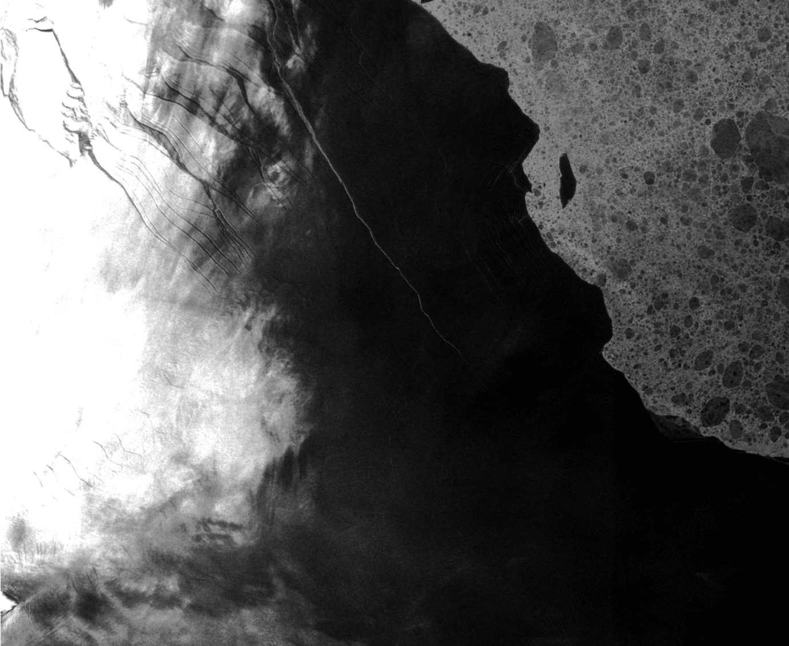

## Hello! I'm Kali 

  **✨ SAR enthusiast, big fan of ice ✨ I use 🛰️ to study ice shelves in Antarctica ❄️**

📚 The programming tools I use most often are:
  
  

🗺️ The geomatics programs I use are:
  
  

