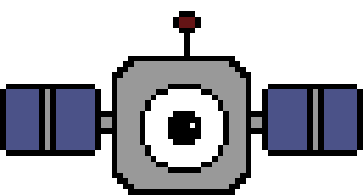

## Hello! I'm Kali 

  **✨ SAR enthusiast, big fan of ice ✨ I use 🛰️ to study ice shelves in Antarctica ❄️**

 Graduate student at the [ICE Remote Sensing Lab](https://www.icelab.ca/) 🍁 SAR specialist at [SmartICE](https://smartice.org/)

    
  

📚 The tools I use most often are:
  
  
  

🗣️ You can find me on:

   
  
 

  
  📄 And you can find my CV [here](KaliMcDougall_CV.pdf).

